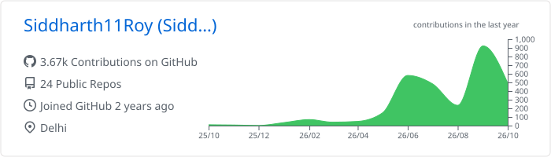
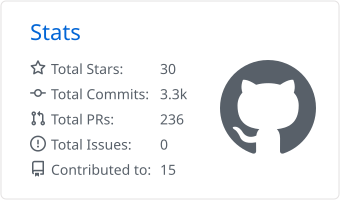
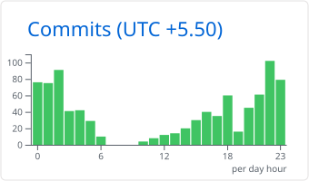

<h1 align="center">Siddharth Roy</h1>

  <b>Applied AI Engineer</b> · multi-agent systems, agent memory and MCP 
  Building at <b>Refound AI</b> · BS Data Science, <b>IIT Madras</b> · Delhi, India

  
  
  

---

I build agents that run for a long time and remember what they did. Right now that means a multi-tenant platform of 10 agents across Gmail, Calendar, Drive and RAG, plus a durable TypeScript + SQLite harness that keeps long-running agents alive through crashes. On the side I work on memory for sub-agents, SSM-style architectures and KV-cache research, and I write about it on X.

- **Agents:** multi-agent orchestration, agent loops, MCP servers, Claude Code skills and hooks, human-in-the-loop approvals
- **Memory and retrieval:** hybrid search (BM25, pgvector, reranking), episodic and semantic memory, evals
- **Earlier:** computer vision (OCR, biometrics), synthetic data (SDV, CTGAN), healthcare document AI

## GitHub at a glance

  

  <picture>
    <source media="(prefers-color-scheme: dark)" srcset="./profile-summary-card-output/github_dark/0-profile-details.svg"/>
    
  </picture>

  <picture>
    <source media="(prefers-color-scheme: dark)" srcset="./profile-summary-card-output/github_dark/3-stats.svg"/>
    
  </picture>
  <picture>
    <source media="(prefers-color-scheme: dark)" srcset="./profile-summary-card-output/github_dark/4-productive-time.svg"/>
    
  </picture>

  
  

  <picture>
    <source media="(prefers-color-scheme: dark)" srcset="https://raw.githubusercontent.com/Siddharth11Roy/Siddharth11Roy/output/snake-dark.svg"/>
    
  </picture>

Most of my work happens in private repositories. These graphs count it, but only as totals.

## Featured work

| Project | What it is |
| --- | --- |
| [**cerebra**](https://github.com/Siddharth11Roy/cerebra) | Memory layer for Claude Code and Codex sub-agents: 9 brain-region modules, episodic and semantic memory, sleep-cycle consolidation recalled via BM25 or vectors |
| [**tldraw-claude-mcp**](https://github.com/Siddharth11Roy/tldraw-claude-mcp) | MCP server and skill that let Claude draw on a live tldraw canvas, bridged over WebSocket + stdio |
| [**harness-benchmark-skill**](https://github.com/Siddharth11Roy/harness-benchmark-skill) | Scores agent sessions with a composite H-score across 6 metrics; ships as a skill, CLI, Python package and live dashboard |
| [**TrimKVcache-implementation-with-Qwen**](https://github.com/Siddharth11Roy/TrimKVcache-implementation-with-Qwen) | The TrimKV cache paper implemented on Qwen, reproducing benchmark behaviour on synthetic data |
| [**XSA-gpt-arch-implementation**](https://github.com/Siddharth11Roy/XSA-gpt-arch-implementation) | Exclusive Self Attention in a GPT-style architecture |
| [**imagepreprocessor**](https://github.com/Siddharth11Roy/imagepreprocessor) | OCR-focused preprocessing for blurred, low-contrast and noisy images |

## Writing and research

- **Multimodal Integration of Haar Cascade, Ocular, Head-Down, and Hand-Gesture Analysis for Automated Attendance and Attentiveness Monitoring**, IEEE 2026
- **SnapKV: What Should an LLM Remember?** An interactive marimo notebook on KV-cache eviction, with entropy-scaled observation windows
- On [X](https://x.com/Pseudo_Sid26): State Space Models and Agent Memory (100k+ views) · Memory Growth and False Memory Propagation in Agents (100k+) · Text-Level Image Blur Detection (200k+) · Self-Attention, Residuals and Exclusive Self Attention (50k+)

## Toolbox

   
   
  

Also: Hugging Face · LiteLLM · Anthropic SDK · LiveKit Agents · Langfuse · OpenTelemetry · RunPod · Fly.io

## Wins

1st at Code Artifacts (SRM) · 1st at Logic-Loom 3.0 and 4.0 · 1st at Data-Vista · 1st at Quantageddon 2.0 · 2nd at PAN-BS ML Challenge 1.0 · Special Mention at the Marimo × alphaXiv Hackathon · AI Grants India residency, top 10 in Delta
